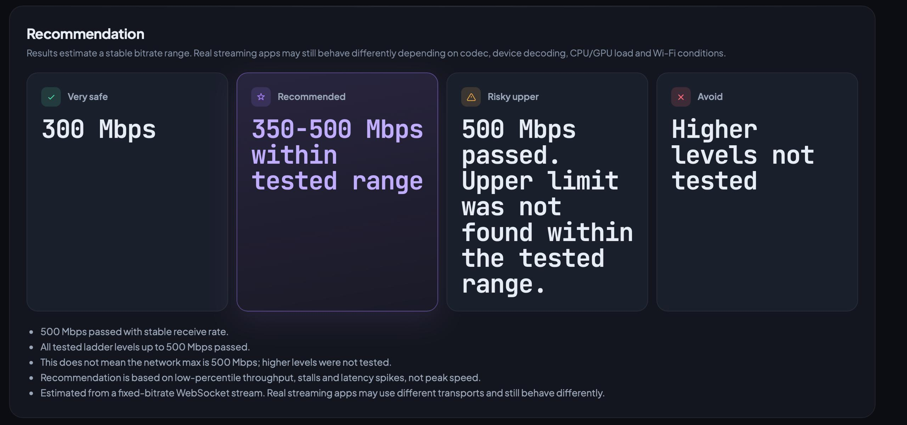
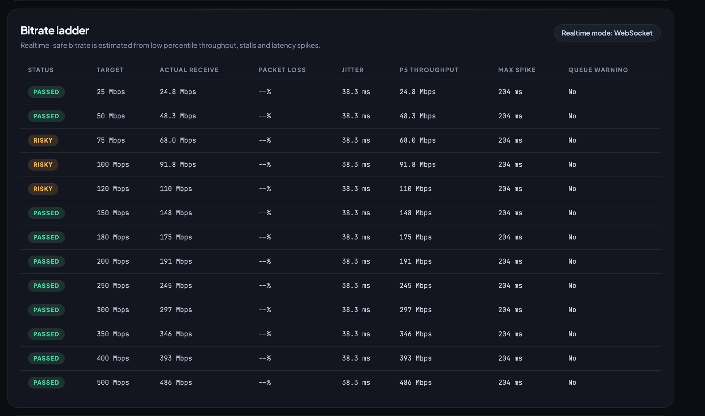

# SpeedBand

[](https://go.dev)
[](LICENSE)
[](https://github.com/ESFRick/SpeedBand/releases)
[](https://github.com/ESFRick/SpeedBand/releases/latest)

**[English](README.md) | [Русский](README.ru.md)**

Диагностируй, достаточно ли стабильна твоя LAN для стриминга в реальном времени. Измеряет задержку, джиттер и низкопроцентильную пропускную способность через браузер - без установки на второе устройство, без телеметрии.


---

## Содержание

- [Что делает SpeedBand](#что-делает-speedband)
- [Почему не iperf3?](#почему-не-iperf3)
- [Сценарии использования](#сценарии-использования)
- [Результаты](#результаты)
- [Зависимости](#зависимости)
- [Быстрый старт](#быстрый-старт)
- [Подключение с другого устройства](#подключение-с-другого-устройства)
- [Брандмауэр](#брандмауэр)
- [Чтение результатов](#чтение-результатов)
- [Отчёты](#отчёты)
- [Рекомендации по тестированию](#рекомендации-по-тестированию)
- [Лицензия](#лицензия)

---

## Что делает SpeedBand

Запускает небольшой HTTP-сервер на вашей машине. Другое устройство открывает страницу в браузере и выполняет полную последовательность тестов:

1. Задержка и джиттер (`/api/ping`)
2. Пропускная способность HTTP-загрузки (`/api/download`)
3. Пропускная способность HTTP-выгрузки (`/api/upload`)
4. Лестница битрейтов WebSocket в реальном времени (`/api/ws`)

Весь трафик остаётся внутри LAN. Результаты включают стабильный диапазон битрейта с уровнями запаса, метку качества и разбивку по лестнице битрейтов.

**Пиковая скорость - не безопасный битрейт для стриминга.** SpeedBand использует низкопроцентильную пропускную способность, джиттер и обнаружение зависаний для оценки безопасного рабочего диапазона.

---

## Почему не iperf3?

iperf3 требует установки на оба устройства и показывает сырую TCP-пропускную способность - не то, что важно для стриминга.

SpeedBand запускается как один бинарник или через `go run`. Второму устройству нужен только браузер. Инструмент измеряет то, что реально используют стриминг-приложения: низкопроцентильную пропускную способность, джиттер, зависания и стабильность битрейта по ступенчатой лестнице. Результат - безопасный диапазон битрейтов с уровнями запаса, а не просто пиковое число.

---

## Сценарии использования

- Игровой и VR-стриминг (Moonlight/Sunshine, Steam Link, Air Link, Virtual Desktop, ALVR)
- Проверка передачи данных на NAS и медиасервер
- Диагностика Wi-Fi
- Тестирование LAN между ПК, телефоном, планшетом, ноутбуком, гарнитурой или Steam Deck
- Проверка, не скрывает ли пиковая скорость джиттер, зависания или нестабильные низкопроцентильные результаты

---

## Результаты





---

## Зависимости

**Go (сервер):**

| Зависимость | Версия | Назначение |
|-------------|--------|-----------|
| Go | 1.22+ | Runtime |
| [gorilla/websocket](https://github.com/gorilla/websocket) | 1.5.3 | WebSocket транспорт |

**UI (браузер, загружается с CDN):**

| Ресурс | Источник |
|--------|---------|
| Plus Jakarta Sans | Google Fonts |
| JetBrains Mono | Google Fonts |

UI переключается на системные шрифты если Google Fonts недоступен. Нет npm, нет шага сборки.

---

## Быстрый старт

**Windows (PowerShell):**

```powershell
go run ./cmd/speedband
```

**Linux / macOS:**

```bash
go run ./cmd/speedband
```

Сборка автономного исполняемого файла:

**Windows:**

```powershell
go build -o speedband.exe ./cmd/speedband
# или
.\scripts\build-windows.ps1
```

**Linux / macOS:**

```bash
go build -o speedband ./cmd/speedband
# или
bash scripts/build.sh
```

Откройте LAN-адрес, напечатанный в консоли, на любом устройстве в той же сети. На втором устройстве не требуется установка приложения - только браузер.

### Флаги

| Флаг | По умолчанию | Описание |
|------|-------------|----------|
| `--host` | `0.0.0.0` | Адрес для прослушивания |
| `--port` | `8080` | Порт |
| `--open` | `false` | Автоматически открыть браузер при запуске |
| `--debug` | `false` | Подробное логирование |

---

## Подключение с другого устройства

1. Запустите SpeedBand на хост-машине.
2. Используйте LAN-адрес из консоли, например `http://192.168.1.25:8080`.
3. Если `.local`-имя хоста не резолвится, используйте числовой IP.
4. На Meta Quest откройте адрес в браузере гарнитуры.

Консоль выводит все IP-кандидаты в LAN и помечает основной. Адаптеры Docker, VM и VPN фильтруются или помечаются там, где это возможно.

---

## Брандмауэр

Если страница не открывается с другого устройства:

- Убедитесь, что оба устройства находятся в одной подсети.
- **Windows:** при запросе разрешите доступ в **частных сетях**. Если запроса не было - разрешите `speedband.exe` или `go.exe` в частных сетях через брандмауэр Windows.
- **Linux:** убедитесь, что порт открыт (`sudo ufw allow 8080/tcp` для дистрибутивов с UFW).
- **macOS:** разрешите входящие подключения в диалоге брандмауэра macOS при запросе.
- Попробуйте числовой IP вместо `.local`.
- Временно отключите VPN.

SpeedBand по умолчанию прослушивает `0.0.0.0`. Запускайте только в доверенной локальной сети.

---

## Чтение результатов

Уровни диапазона битрейта:

| Уровень | Значение |
|---------|----------|
| Очень безопасный | Консервативная оценка с запасом |
| Рекомендуемый | Практичный стабильный рабочий диапазон |
| Рискованный верхний | Может работать; показал сниженный запас или всплески |
| Избегать | Не рекомендуется без проверки в реальном приложении |

Метки качества:

| Метка | Значение |
|-------|----------|
| Отлично | Высокая низкопроцентильная пропускная способность, низкий джиттер |
| Хорошо | Подходит для большинства задач реального времени |
| Приемлемо | Используемо; оставляйте запас |
| Рискованно | Нестабильно настолько, что требует осторожности |
| Нестабильно | Не подходит для высокобитрейтного использования в реальном времени |

---

## Отчёты

- **Скачать JSON** - сохраняет отчёт на клиентском устройстве.
- **Сохранить на сервер** - отправляет отчёт на хост-машину; сохраняет `.log`-файл в папке `reports/` в рабочем каталоге сервера.

Интерфейс поддерживает английский и русский. Отчёты используют язык, выбранный в браузере на момент сохранения.

---

## Рекомендации по тестированию

- Подключите ПК к роутеру по Ethernet.
- Используйте Wi-Fi 5 ГГц или 6 ГГц для второго устройства.
- Закройте активные загрузки, облачную синхронизацию и обновления игр.
- Запустите полный тест стабильности перед выбором высокого битрейта.
- Повторите 2–3 раза; доверяйте более консервативному результату.

---

## Лицензия

MIT
